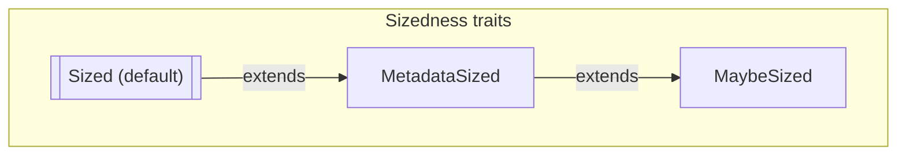
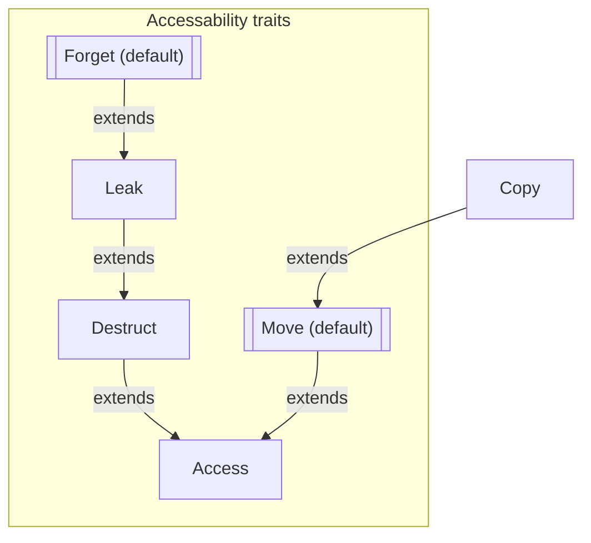
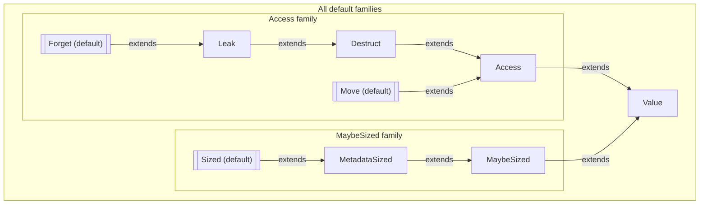

`only` bounds are going to be the most impactful change to Rust that you've never heard of. They are currently being designed and developed by the Arm team (David Wood, Rémy Rakic, et al.) as part of the [Sized Hierarchy and Scalable Vector Extensions][PG] project goal.  This post explores the feature and aims to answer a particular question about the design (the scope of bounds, I'll explain). But before I dive in, I want to give a bit of context.

[PG]: https://rust-lang.github.io/rust-project-goals/2026/scalable-vectors.html

## Rust generics have a `Sized` bound by default today

In today's Rust, every type parameter (except for `Self`) has a default bound called `Sized`:

```rust
// So this function...
fn identity<T>(t: T) -> T {
    t
}

// ...is actually short for
fn identity<T>(t: T) -> T
where
    T: Sized, // <-- Added by default!
{
    t
}
```

A type `T` implements `Sized` if the compiler can compute the size of a `T` value at compilation time. This is true for almost every type, with a few notable exceptions. Consider `[u32]`, which refers to "some number of `u32` instances". We know that a single `u32` is 4 bytes, but without knowing how many `u32` there are, you can't know the size of `[u32]`. This means you can't have a value of type `[u32]` on the stack (how big should the stack frame be?).

## You opt out with `?Sized`

However, if you have a function like `by_ref`, that just takes the value *by reference* (i.e., by pointer), you shouldn't need to know how big the `[u32]` value is, because you're not manipulating it directly. You can have a type parameter `U` that doesn't require `Sized`, but you have to explicitly "opt out" from the default bound:

```rust
fn by_ref<U>(t: &U)
where
    U: ?Sized, // <-- Opt out from the default
{ }
```

As a fun bit of historical trivia, this system was introduced way back in 2014 to accommodate [Dynamically Sized Types](https://smallcultfollowing.com/babysteps/blog/2014/01/05/dst-take-5/). Before that, `&[u32]` was actually a built-in, indivisible type; we even wrote it like `[u32]/&` for a time.[^str]

[^str]: In fact, I recall that in one of my blog posts I proposed writing `""` as the way to spell `&str`. I kinda wish we had done that just for the sheer wackiness of it (`fn foo(name: "")`).

## But `Sized` vs `?Sized` isn't enough for everything we need

The `Sized` vs `?Sized` design has served us reasonably well but it is also showing its limits. It turns out that "value has a statically computable size" vs "each value has a distinct size computable at runtime" doesn't cover all the things you might want. For example, `extern` types are types whose values have no known size, even at runtime. And then Arm's Scalable Vector Extensions want to describe SIMD types where every value of the type has the same size (unlike `str` and `[T]`, where each value can have a different length) but where that size is not known until runtime.

## A richer `Sized` hierarchy

Rather than just `Sized` or `?Sized`, what we really want is to have a richer hierarchy. The current plans look something like this:



where

* `trait Sized` means that all values have the same size and that size can be computed knowing only the type.
* `trait MetadataSized` means that values can have different sizes and that size can be computed given the metadata attached to a reference to the value. Examples include `[T]` or `dyn Trait`.
* `trait MaybeSized` is implemented for all values and tells you nothing about the value's size.

Two caveats:

1. I'm excluding the way that Arm's scalable vector extensions fit into this, because it's orthogonal.
2. The trait names aren't settled. I'm using the names I understand the libs-api team to prefer; they're not my favorites, but that's ultimately the team who owns stdlib bikesheds, so I defer to them.[^actions]

[^actions]: I prefer names that refer to the *operations* that can be performed on the values, so e.g. instead of `MetadataSized` I would prefer `SizeOfVal`, since it means that you can invoke the `std::mem::size_of_val` function on it.

## Problem: `?Sized` notation doesn't scale to this hierarchy

But now we have a kind of problem. The `?Sized` notation was predicated[^pun] on the idea that users should specify the default bound they are opting out of -- i.e., the `?` is meant to say "I don't know if this is `Sized` or not" (unlike the default, where you know it is `Sized`). But "opting out" from a bound doesn't work so well with a multi-level hierarchy. When you write `?Sized`, does that correspond to `T: MetadataSized` (but not `T: Sized`)? And what if we want to insert another level in between `T: MetadataSized` and `T: Sized` later? Then we either have to change what `T: ?Sized` means (to refer to the new bound) or we have to have `T: ?Sized` drop *two* levels down the hierarchy. Even more annoying, what do we do while that middle rung is unstable? Surely `T: ?Sized` shouldn't refer to an unstable trait... what if we decide to remove it 

[^pun]: Little logic pun there for you.

## Solution: `only` bounds

The new proposal is to write `T: only MetadataSized` or `T: only UnknownSized` instead of `T: ?Sized`. An `only` bound combines two things:

1. Like any bound, it includes a "minimum requirement" -- i.e., `T: only MetadataSized` means that `T` must implement *at least* `MetadataSized`.
2. It additionally disables some *default* bounds -- i.e., we will *not* add the default `T: Sized` bound.

The name `only` comes from the fact that `T: Sized` implies `T: MetadataSized`. So the default of `T: Sized` already means that `T: MetadataSized` for free; but when you write *only* MetadataSized, you are saying "I don't need the full hierarchy, just `MetadataSized` will do".

## `only` bounds work like normal bounds: ask for what you need

A nice feature of `only` bounds is that they work more like a regular bound. Whereas a `?` bound is saying "I don't need this", an `only` bound is saying what you *do* need. So e.g. if you are writing a function that just has references to values of type `T` does not care what their size is, you can write

```rust
fn by_ref<U>(u: &U)
where
    U: only MaybeSized,
{}
```

If you are writing a function that *does* need to compute the size of values of type `V`, you can ask for that capability:

```rust
fn checks_size<V>(v: &V)
where
    V: only MetadataSized,
{
    std::mem::size_of_val(v)
}
```

## `only` bounds allow for new levels to be added later

A nice feature of `only` bounds is that, later on, we can add new levels to the hierarchy, and they work normally. For example, suppose we wish to add something like `Aligned` where the *size* is not known at compilation time but the alignment *is*. We could change the hierarchy to

```rust
trait Sized: Aligned
trait Aligned: MetadataSized // <-- new!
trait MetadataSized: MaybeSized
trait MaybeSized
```

and functions with `U: only MaybeSized` (like `by_ref`) and with `V: only MetadataSized` (with `checks_size`) would continue to have the same requirements. But new functions could be written with `T: only Aligned` that would use the new bound. And there is no conflict with stabilization; code that writes `T: only Aligned` can be considered unstable until that middle hierarchy is finalized.

## `only` bounds compose normally

Like any other bound, `only` bounds are combined with other bounds to form the overall requirements. So it is possible to write e.g. `T: only MetadataSized + Sized`. This is equivalent to `T: Sized` and therefore equivalent to the default and *therefore* kind of pointless, but you can write it. Similarly, given that `trait Clone: Sized`, if you write `T: only MetadataSized + Clone`, that is kind of pointless too: you might as well write `T: Clone`, which would be equivalent. We plan to have a warn-by-default lint for that.

## Scaling `only` to other "default bound families" (speculative)

The final strength of `only` bounds is that they allow us to introduce whole new *families* of default bounds. One example is the idea of [introducing a `Move` bound](https://smallcultfollowing.com/babysteps/blog/2025/10/21/move-destruct-leak/). Note that this is a distinct feature and is not covered under the [current RFC][RFC].

All types in Rust today are "movable" and "forgettable", meaning that you can memcpy the value from place to place so long as you stop using the previous location *and* you can recycle the memory where it is stored without running the value's destructor. There is one notable exception -- when you pin a value, you it can no longer be moved, and you must run its destructor before its memory is reused -- but otherwise this is a hard-and-fast rule. And that's annoying!

The problem is that not being able to guarantee that a destructor runs blocks a lot of unsafe code patterns. For example, [scoped tasks a la `rayon` depend on a destructor for safety](https://smallcultfollowing.com/babysteps/blog/2016/10/02/observational-equivalence-and-unsafe-code/). In sync code, this works because we've decided it's UB to unwind a stack frame without running the destructors of values stored there, and so if you put a local variable on the stack, you can be sure its destructor will run. But that doesn't work in `async` code! And there are times when unwinding *without* running destructors would be nice.

The solution is to introduce a second family of default traits. Unlike the `Sized` family we saw before, this family defines fine-grained capabilities about how values of that type can be used:



The meaning of the traits are as follows:

* `Forget`, the default, says that you can recycle the memory for a value without running its destructor.
* `Leak` says that you can skip running a destructor for a value, but only if you never reuse the memory where the value resides.
* `Destruct` says that if you have a value of this type, you can reuse the memory where it resides by running its destructor.
* `Copy`, which already exists, says that you can memcpy the place and keep using the original place; it's not really a default, but I included it because it is relevant.
* `Move`, another default, says that you can memcpy the value to a new place if you stop using the original.
* `Access` is the root of this family. It indicates a value that can be "accessed in place" (basically, any value at all).

This introduces new checks into the compiler:

* When you move a value (i.e., `a = b` where `b` is not used later), we will check that the type implements `Move` (whereas today, it is always allowed).
* When you exit a scope, we will check that the values in each local variables have either been moved or have a type that implements `Destruct`.

Some implications:

* If your function owns a value of type `T: only Destruct`, then you *must* destruct it before your function returns. You can't move it (because you don't know if it implements `Move`) and you can't leak or forget it either.
* If your function owns a value of type `T: only Move`, then the only thing you can do with it is move it somewhere else. You can't drop it (because you don't know if it implements `Destruct`).
* No function can own a value of type `T: only Access`, because you wouldn't be able to move it nor drop it, and hence you could not return. But you could have such a value (say) in a `static`.

## How `only` bounds could work in the presence of multiple families

The spur for writing this blog post was a question in a lang team meeting on how `only` bounds ought to work given the existence of multiple "families" of default traits, as I described above. Although the [current RFC][RFC] is looking only at the `Sized` traits, we expect to look at the "access family" in a future RFC, so we want to be sure we are not making any decisions that won't scale to cover both.

The way I imagine it working is like this. Each default traits is associated with one or more "families". When you have an only bound, it "opts out" from all default traits in each family that the trait is associated with:

* `T: only Move` opts out from `Forget`, `Leak`, `Destruct` -- but not `Sized`.
* `T: only Destruct` opts out from `Forget`, `Leak`, and `Move` -- but not `Sized`.
* `T: only MetadataSized` opts out from `Sized` -- but not `Forget` or `Move`.
* `T: only MaybeSized` opts out from `Sized` -- but not `Forget` or `Move`.

You may also want to "opt back in" to some defaults. For example, `T: only Move + Destruct` is a sensible thing to do. It means values that can be moved and destructed but not leaked or forgotten.

## Examples

### `Option::map` requires `only Move`

`map` is an example of a function that only needs `Move`. You need to be able to destructure `self` (which *moves* the optional value out into a local variable `v` and then invoke the closure `op`, which again moves the wrapped value `v`:

```rust
impl<T: only Move> Option<T> {
    fn map<U: only Move>(
        self,
        op: impl FnOnce(T) -> U,
    ) -> Option<U> {
        match self {
            Some(v) => Some(op(v)),
            None => None,
        }
    }
}
```

One interesting thing is the result type `U`. Using only the stuff I wrote in this blog post, it needs to be `only Move`, because the result will be moved into the `Some` value and so forth. But [in-place-init](https://rust-lang.github.io/rust-project-goals/2026/in-place-init.html) would allow for this definition to omit the `U: only Move` bound because we could statically guarantee that the `Option` will be constructed in place and never moved after that.

### `Option::or` requires `only Move + Destruct`

The `a.or(b)` method on `Option` returns `a` if it is `Some` and otherwise returns `b`. This is an interesting one because the value `b` may not be used and therefore requires `only Move + Destruct` bounds.

```rust
impl<T: only Move> Option<T> {
    fn or(
        self,
        alternate: Option<T>,
    ) -> Option<T>
    where
        T: Destruct, // <-- because it may be dropped
    {
        match self {
            Some(v) => Some(v), // drops `alternate`
            None => alternate, // moves `alternate`
        }
    }
}
```

### `Rc` requires `MaybeSized + Leak`

The `Rc` type is an example where we would want to relax bounds from both families:

```rust
struct Rc<T: only MaybeSized + only Leak> {}
```

I believe the proper minimum bounds for `Rc` are:

* `only MaybeSized` because while it can store `MetadataSized` or `Sized` things, it doesn't have to, it can also store things of an non-computable size (although it does raise the question of how they would be freed, but that's an allocator concern).
* `only Leak` because `Rc` values can form cycles and thus we can't ever guarantee the destructor will be run. Interestingly, `Rc<T>` can implement `Forget` even its contents don't.

## Frequently asked questions

### What is actually under RFC today?

The post may be a bit confusing here. The [*current RFC*][RFC] is looking only at the proposed "Sized" traits. The `Access` family is a speculative future extension that we are exploring but at a much earlier stage.

[RFC]: https://github.com/rust-lang/rfcs/pull/3729

### Can I use `only` with *any* trait?

In the beginning, the plan would be that `only` can only be used for well-known, *default* traits (e.g., `Move`, `Sized`, etc). In the future though there are some thoughts to generalizing it.

### Why not opt out from *all* defaults at once?

An alternative that was proposed is to have the opt-out be per-type-parameter. So you might write something like

```rust
fn foo<T: MetadataSized + ?default>
```

which would "opt out" from *all* defaulted bounds. Obviously we'd have to bikeshed the syntax, but ignore that for now. The question is whether opting out of *all* defaults is better than opting out of a single family. I prefer the per-family option for two reasons:

* First, things like `T: only Move` demonstrate that you might very reasonably which to opt out from a single family but retain the default `Sized` bound. I think it's likely that there will be many functions that want to opt out of `Sized` *or* `Forget` *but not both*.
    * You might think that we could make `Move: Sized` to get the same effect, but I think that would be a mistake. The fact that a value's size must be computed dynamically doesn't inherently mean it can't be moved.
* Second, it makes it harder to introduce new families later, if we decide there are other orthogonal properties of values that we'd like to relax.

### Why do you think it's likely that people want to opt out of being `Sized` *xor* `Forget` *but not both*? 

Because the `Forget`, `Move`, and similar traits mostly apply to owned values. The examples we saw with `Option<T>` were quite typical. And when you are moving values of type `T` around, you need that `T` to be `Sized`.

### But we saw that `Rc` wanted to opt out of both families with `only Leak + only MetadataSized`, right?

Yes, that's true, and I think that particular combo will be common. I don't think that's an argument for the `?default` approach on its own, though, particularly since that case would not be much cleaner or shorter...

```rust
impl<T: ?default + Leak + MetadataSized> Rc<T> {}
```

...what I think that argues for is actually *trait aliases and shorthands*.

### Wait, trait aliases and shorthands? Can you elaborate?

Yes! I think that a future RFC could extend only bounds to allow you to define trait aliases with "only bounds" as supertraits:

```rust
trait RefCountable = only Leak + only MetadataSized;

// Equivalent to:
// trait RefCountable: only Leak + only MetadataSized {}
// impl<T> RefCountable for T where T: only Leak + only MetadataSized {}
```

You could then use an `only RefCountable` bound to define `Rc<T>`:

```rust
impl<T: only Refcountable> Rc<T>
```

*Without the `only`,* `T: Refcountable` would just be a regular trait bound and would not opt-out from any defaults.

### Can we use a "root" trait to opt out of all defaults?

Yes, we could! You could define an alias like `Value`:

```rust
trait Value = only Access + only MaybeSized;
```

Since `Access` and `MaybeSized` are both implemented for all types, this effectively becomes part of both families:



Then you can do `T: only Value` and opt out from both families at once.

### If we did that, what would happen if we wanted to add a new family in the future?

Ay, there's the rub. If we wish to add a new family in the future, let's say for values that don't live in the same memory space (`T: only Distributed`...?), then `Value` would be "out of date" because code written against `Value` would still be assuming uni-memory-space values. But we could make `Value` into an edition-dependent alias or something like that, as has been discussed.

### Can we decide whether we want `Value` later?

Yes! We can introduce a root trait at any time. So we can add the `Sized`-ness family first, then the `Access` family, and then see how we feel. Maybe we find people are very commonly opting out of both-- in which case, some aliases are useful, or perhaps a `Value` variant.

The only way we might "regret" it is if, in practice, people usually just opted out of both and then opted back in to what they want specifically. But we already know that `T: only Move` will be common and clearly `T: only Value + Move + Sized` is more awkward in that case, so I don't consider that very likely.

### Why the name `Destruct` and not `Drop`?

That name comes from the `const trait` RFC. There are a few reasons to move away from `Drop`. The first is that it is possible to have a destructor even if you don't implement `Drop`: `Drop` really refers to *user-provided logic* in the destructor, but the compiler adds its own logic ("drop glue", it's sometimes called) to drop all the fields in the value. The second reason is that the `Drop` trait itself needs some revision, so moving away from that name lets us have other ways to specify custom logic (e.g., pinned self, or by-value, etc etc).

### How does this interact with `const` traits anyway?

Quite beautifully! In fact, the proposal from Arm for SVE is to introduce the idea of `T: const Sized` being "a type whose size can be computed at compilation time", which I find quite elegant. Similarly `T: const Destruct` was proposed by the const RFC as a way to say that a value has a constant destructor.

### It's annoying to write `T: only Move + Destruct`. Couldn't we have `Destruct` imply `Move` so that I can just write `T: only Destruct`?

My original proposal for introducing linear types had `Destruct` extending `Move`. This would mean that the `Option::or` proposal could simply do `U: only Destruct` and not `U: only Move + Destruct`. However, Alice Ryhl and others pointed out that there are immovable types that must nonetheless be destructed, so it doesn't make sense to combine those.

### Where can I learn more?

The [Project Goal][PG] has a lot of details. The latest updates are available on the [tracking issue][TI]. If you like watching videos, I recommend David Wood's [Rust Nation talk][talk].

[talk]: https://youtu.be/dngSPnu-B10
[TI]: https://github.com/rust-lang/rust/issues/144404

## Conclusion

I want to close with a meta-observation and a big shout-out to the Arm team. I think they are showing how awesome open-source can be. The Arm team's primary motivation is adding support for Scalable Vector Extensions. This helps Rust make full use of Arm processors. This is, in and of itself, a laudable goal, and valuable to Rust: One of Rust's assets, in my view, is that it gives you access to all the power your processor has to provide, and that should include unique extensions.

But rather than add the feature as a kind of special-case extension to Rust, the Arm team is going further and driving a general purpose improvement, one that will unlock a bunch of other features (extern types and, to some extent, guaranteed destructors; guaranteed destructores themselves unlock scoped async threads and better Wasm integration). I love that.

